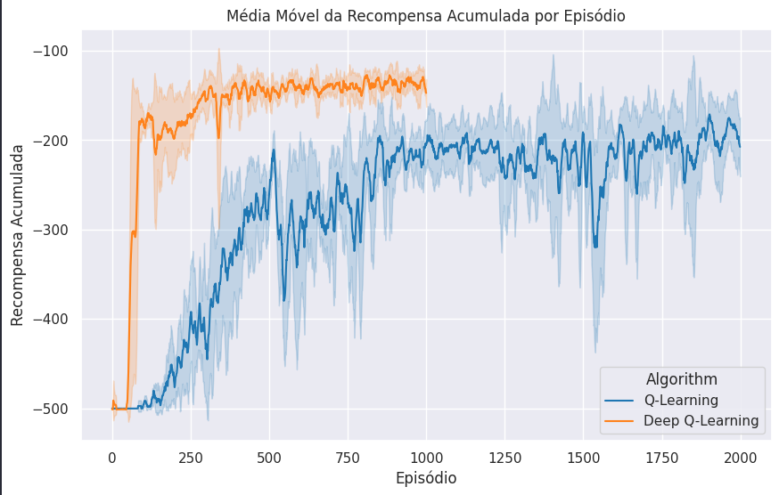
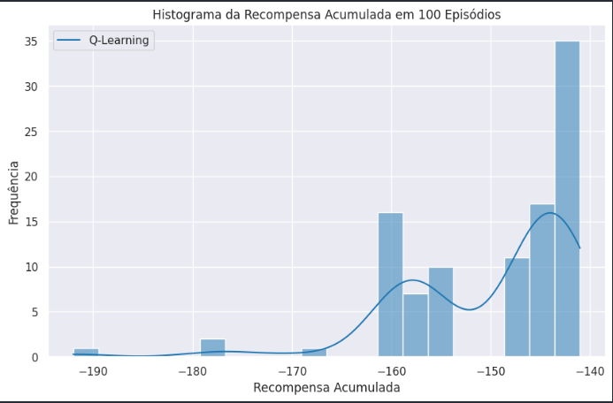
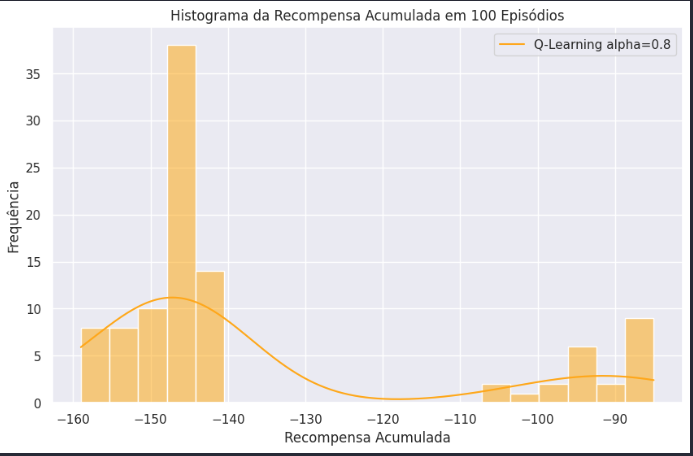

[](https://classroom.github.com/a/3cFWPdqG)

# **Q-Learning x Deep Q-Learning for Mountain Car Environment**

Nessa experiência, vamos comparar as diferenças entre Q-Learning e Deep Q-Learning para o ambiente Mountain Car.

## **Action Space e Observation Space**

Diferente de outros ambientes da biblioteca `gymnasium`, o Mountain Car possui um ambiente contínuo, no qual as observações de um estado são um representadas por um vetor de duas dimensões, onde a primeira dimensão é a posição x do carro e a segunda é a velocidade do carro. O espaço de ações é discreto, com apenas três ações possíveis: acelerar para a esquerda, acelerar para a direita e não acelerar.

## **Como executar os experimentos**

Para executar os experimentos, basta usar o notebook `mountain-car.ipynb` e seguir as instruções contidas nele. Ele realiza um treinamento com 5 experimentos para ambos os algoritmos, Q-Learning e Deep Q-Learning, e plota os resultados, além de testar o modelo treinado. Para instalar as dependências, primeiro crie um ambiente:

```bash
python -m venv .env
```

E ative o ambiente:

```bash
source .env/bin/activate
```

Depois, instale as dependências:

```bash
pip install -r requirements.txt
```

# **1. Q-Learning**

No Q-Learning, o agente aprende uma função de valor que é mapeada por meio de uma tabela de valores Q. Dessa maneira, um ambiente contínuo como o Mountain Car pode ser discretizado para que o agente possa aprender a política ótima. Os detalhes da discretização do ambiente estão no algotimo `QLearning.py`.

Os hiperparâmetros utilizados para o Q-Learning foram os encontrados na experiência anterior (`05-mountain-car`):

- `alpha`: 0.1
- `gamma`: 0.99
- `epsilon`: 1.0
- `epsilon_decay`: 0.995
- `epsilon_min`: 0.01
- `max_steps`: 500

O agente foi treinado em **5 experimentos**, para termos dados que computem a média e o desvio padrão dos resultados, ao longo de 10000 episódios de treinamento cada. Então, ele foi testado em 100 episódios de teste.

A persistência da Q-table foi feita na pasta `/logs`, junto com os rewards do treinamento.


# **2. Deep Q-Learning**

No Deep Q-Learning, o agente aprende uma função de valor que é mapeada por meio de uma rede neural. Dessa maneira, não é preciso discretizar o ambiente. A entrada da rede será os 2 valores do ambiente e a saída será um vetor de 3 valores, representando as ações possíveis. Os detalhes da implementação do agente Deep Q-Learning estão no arquivo `DeepQLearningTorch.py` (o script original em keras foi atualizado para usar torch). Os hiperparâmetros utilizados para o Deep Q-Learning e a arquitetura da rede foram:

- `alpha`: 0.001
- `gamma`: 0.99
- `epsilon`: 1.0
- `epsilon_decay`: 0.995
- `epsilon_min`: 0.01
- `max_steps`: 500
- `batch_size`: 64
- `memory_size`: 10000

A rede neural utilizada foi:

```python
class DQNModel(nn.Module):
    def __init__(self, input_dim, output_dim):
        super(DQNModel, self).__init__()
        self.fc1 = nn.Linear(input_dim, 256)  # First Dense layer
        self.fc2 = nn.Linear(256, output_dim)  # Output layer

    def forward(self, x):
        x = F.relu(self.fc1(x))
        return self.fc2(x)  # No activation on output (equivalent to linear activation)
```

A persistência da rede treinada foi feita na pasta `/data`, e os rewards do treinamento na pasta `/results`.


# **3. Resultados**

Os resultados encontrados no treinamento foram:



*OBS: O Deep Q-Learning termina em 1000 episódios pois já convergiu com essa quantidade. O Q-Learning está cortado em 2000 episódios pois não apresentou melhora na curva após esse nível. Os gráficos completos separados por algoritmo podem ser encontrados no notebook.*

Como podemos observar, o Deep Q-Learning obteve resultados melhores que o Q-Learning, com uma média de reward de -150 e com uma oscilação menor que o Q-Learning convencional. A maior eficiência do Deep Q-Learning pode ser explicado por diversos fatores, como a capacidade de generalização da rede neural, a possibilidade de lidar com ambientes contínuos, sem necessidade de discretização, e a capacidade de aprender funções mais complexas.

### Que indicador é importante utilizar para avaliar se o agente está alcançando o objetivo?

Considerando o objetivo do agente nesse ambiente, foram escolhidos alguns indicadores que conseguem ilustrar claramente o desempenho do agente após seu treinamento:

1. Média de recompensas por episódio: quando mais negativa, maior foi a quantidade de passos que o agente precisou para alcançar o objetivo, o que é negativo.

2. Desvio padrão das recompensas por episódio: quanto maior, mais instável foi o aprendizado do agente.

3. Número de vezes que o agente não conseguiu alcançar o objetivo: dentro de 100 episódios de teste, apesar do agente conseguir bons resultados em alguns cenários, ele pode ter encontrado um cenário que ficou "preso". Assim, também é importante avaliar quantas vezes o agente não conseguiu alcançar o objetivo.

Como exemplo, abaixo podemos analisar o histograma dos dois ALGORIMOS utilizados no teste de 100 episódios para cada (mais detalhes no notebook).





***OBS: no segundo gráfico, a legenda está Q-Learning alpha=0.8, deveria ser Deep Q-Learning***

Podemos ver que o Deep Q-Learning performou melhor, com o resultado mínimo de -160 (que foi próximo do máximo do Q-Learning tradicional), e com uma variância menor. Mais detalhes podem ser encontrados no notebook.